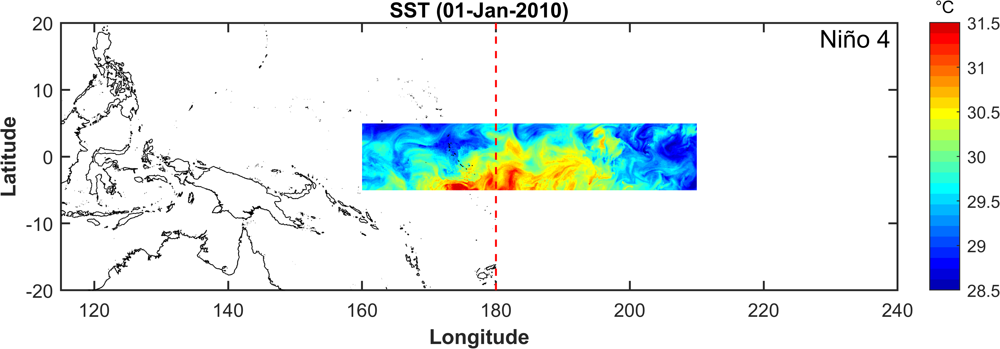

# get_hycom_online

A MATLAB function to download hycom data easily (1992-10-02 to present)

### New features (9 Mar, 2025)

1. get_hycom_online works for the latest hycom product after 2024-09-04 (ESPC-D-V02).
2. the downloaded file can be saved in NetCDF format.
3. the prefix name of downloaded files can be customized.
4. this function will splice the two parts together when the provided region crosses longitudinal boundaries of the selected hycom product.

## Example-1: Download HYCOM data of a particular moment

```Matlab
clc;clearvars
aimpath = 'E:\data\';
region = [190 240 -5 5]; % Niño 3.4
% region = [160 210 -5 5]; % Niño 4 
timeTick = datetime(2010,1,1);
varList = {'ssh','temp','salt','uvel','vvel'};    
D = get_hycom_online(aimpath, region, timeTick, varList);
```

## Example-2: Download HYCOM data in netcdf format and customize prefix names

```Matlab
clc;clearvars
aimpath = 'E:\data\';
region = [117.5 122.5 37 41]; % the Bohai Sea
timeTick = datetime(2010,1,1);
varList = {'ssh','temp','salt','uvel','vvel'};
D = get_hycom_online(aimpath, region, timeTick, varList, 'format', 'netcdf', 'prefix', 'bohai_sea');
```

## Example-3: Download HYCOM data in batch

```Matlab
clc;clearvars
aimpath = 'E:\data\';
region = [117.5 122.5 37 41]; % the Bohai Sea
timeList = datetime(2020,1,1):hours(3):datetime(2020,2,1);
varList = {'ssh','temp','salt','uvel','vvel'};

nTimes = numel(timeList);
for iTime = 1:nTimes
    timeTick = timeList(iTime);
    D = get_hycom_online(aimpath, region, timeTick, varList);
end
```

## Example-4: Download data from a specified HYCOM product

```Matlab
clc;clearvars
aimpath = 'E:\data\';
region = [261 280 17.5 32.5]; % the Gulf of Mexico
timeTick = datetime(2010,1,1);
varList = {'ssh','temp','salt','uvel','vvel'};    
URL = 'http://tds.hycom.org/thredds/dodsC/GLBy0.08/expt_93.0?';
D = get_hycom_online(aimpath, region, timeTick, varList, 'URL', URL);
```

## Sample Graph

Niño 4 region is a good example because it crosses the longitudinal boundaries of some hycom products. In this case, the function will splice the west and east parts together to get the desired data.


